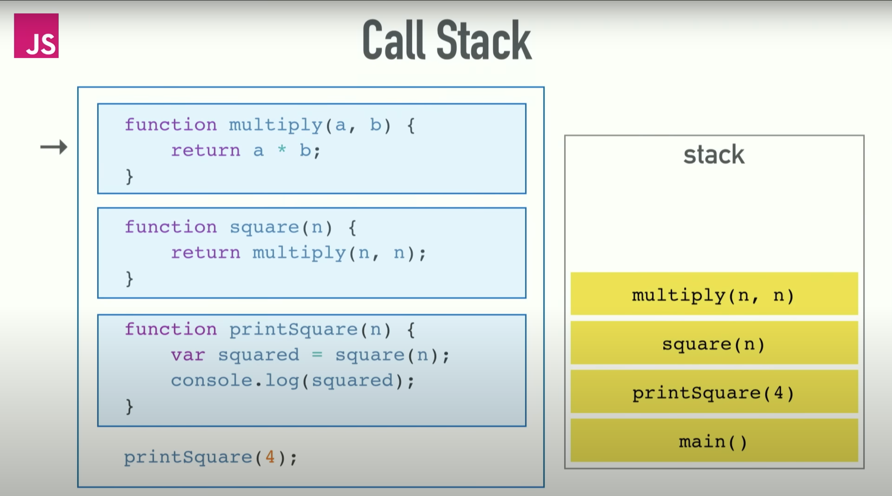

# Call Stack
> Javascript is a single threaded programming language, – single threaded Runtime.  

This means it has a single `call-stack`:  
One Tread == One Call Stack == One Thing At A Time  

Let's visualize:
```javascript
function multiply(a, b) {
  return a * b;
}

function square(n) {
  return multiply(n , n);
}

function printSquare(n) {
  var squared = square(n);
  console.log(squared)
}

printSquare(4);
```
> The `Call Stack` is basically a data structure, which records where in the program we are.  
> So, if we step into a function – we put something 
> into the `Stack`, and if we return from a function, we pop off the `Stack`.

  

1. it reads from the top and sees the function call of `printSquare()`, it pushes this function into the `Stack`
2. then it reads the functional scope and sees another function call in it. It pushes this function call next.
3. and so on, until it gets to the last one.
4. then it starts invoking functions and popping them off the `Stack`

In case you call this, for instance, then a `RangeError: maximum call stack size exceeded`:
```javascript
function foo() {
  return foo();
}
foo();
```
