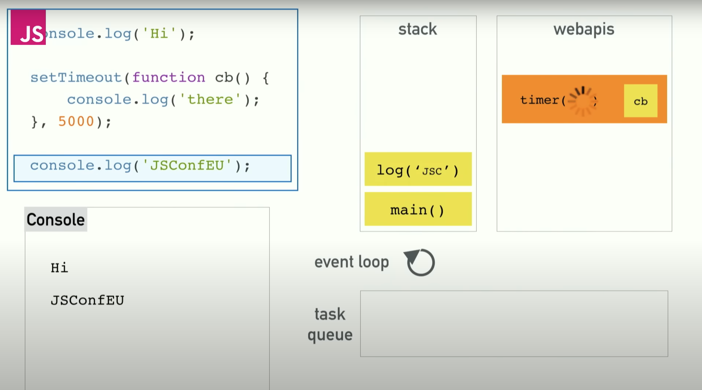

# Blocking
What happens when things are slow?  

```javascript
var foo = () => getSync('https://foo.com');
var bar = () => getSync('https://bar.com');
var qux = () => getSync('https://qux.com');

console.log(foo);
console.log(bar);
console.log(qux);
```
So, here the `Call Stack` will be filled with the first function call, and we will until it is done, the next one will not get into the
`Call Stack`, and so on...


The problem three is because we are running code in browsers. So the solution here is `Asyncronous Callback`.
```javascript
console.log('Hi'); // 1

setTimeout(() => {
  console.log('There'); // 3
}, 5000);

console.log('CoreJS'); // 2

// Hi
// CoreJS
// There
```
So, async callbacks in regard to the `Stacks`:
1. it starts
2. push the first `console` to the Stack, runs it and pops off.
3. then it sees the `setTimeout(cb, 5000)` and it cannot push it into the `Stack`, but where did it go? => [follow next chapter...](#concurrency--the-event-loop)
4. push the third `console` to the Stack, runs it and pops off.

## Concurrency & the Event Loop
The `setTimeout()` is provided to us by the browser, and it doesn't live in the V8 source.  
So, when it sees `setTimeout()` which takes time and is not complete, it pops off the `Stack` and proceed to invoke other synchronous 
functions, while `setTimeout()` callback function remains in a **webAPI** and it waits until it completed.  

After sync functions are done, it moves the `timer` into the `Task Queue`. 


And here where the `Event Loop` comes.
