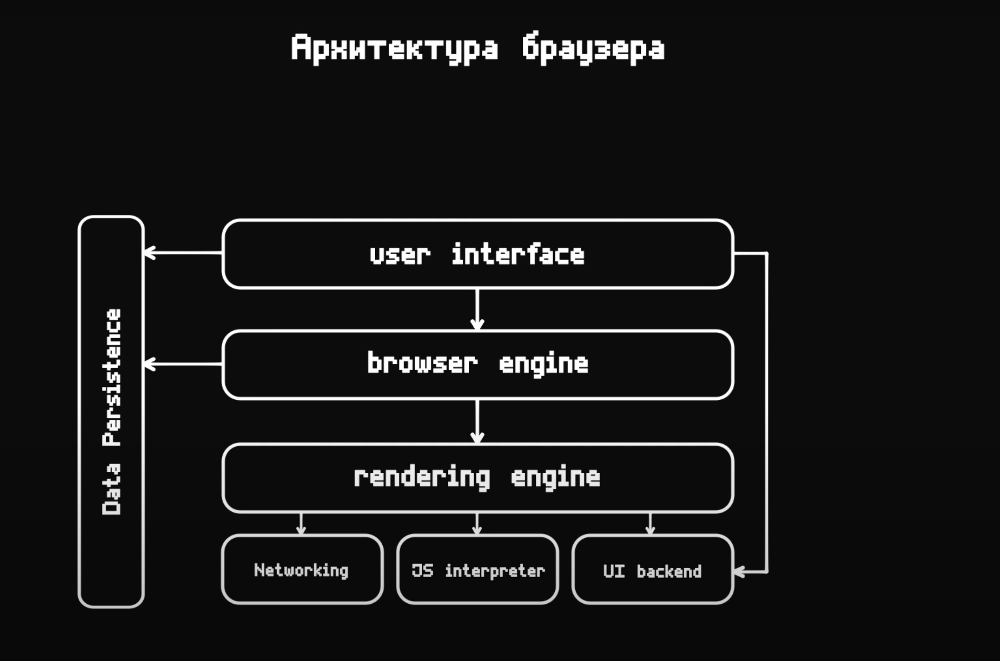
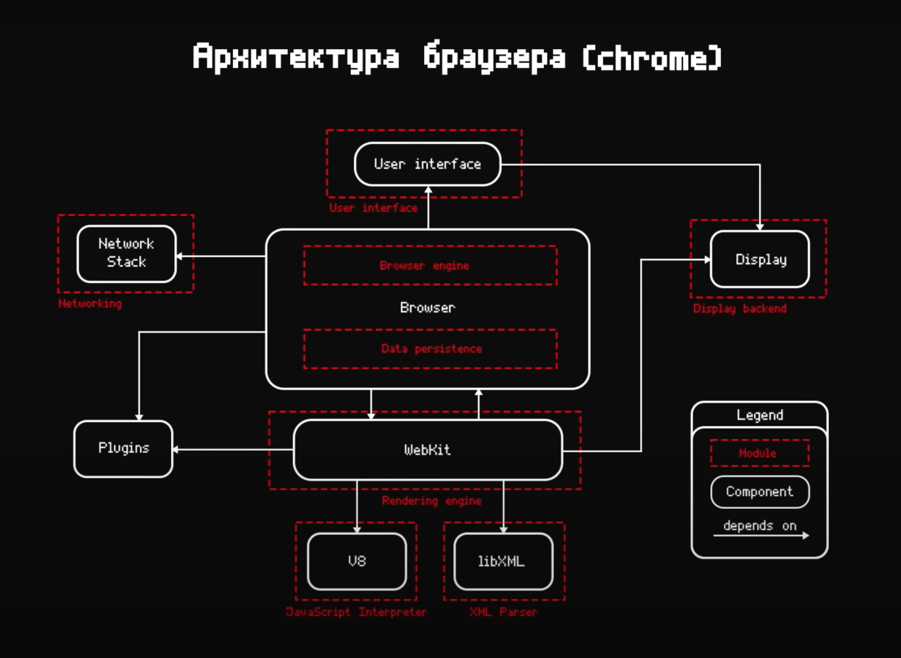

# Архитектура браузера
Каждый браузер состоит из:
- `UI` – это та часть браузера, с которой пользователь взаимодействует
- `Browser engine` (Браузерный движок) – соединительная часть между UI и механизмом рендеринга. На основе данных от пользователя, он 
  взаимодействует с этим механизмом рендеринга и управляет им.
- `Rendering engine` – благодаря ему пользователь получает запрошенные страницы (самые популярные – это: `WebKit` Google Chrome, и `Gekka` 
  Firefox).
> Основная задача этого движка в обработке написанного кода: HTML, CSS, Javascript.

## Networking
Отвечает за: 
- историю посещённых сайтов, 
- за доменные имена, 
- за взаимодействие с DNS server
- за правила обработки различных доменов
- HTTP, HTTPS, 
- открытие TCP соединений
- взаимодействие по UDP
- обмены пакетами (`packets`)
- и так далее...

## JS Interpreter
Это непосредственна та часть, которая обрабатывает Javascript код.  
Самый популярный движок – `V8`. Поверх него построен Node.js, google Chrome.

`V8` предоставляет:
- heap (куча) – область памяти, где хранятся объекты, массивы, функции, и так далее. 
- `Call Stack` – предоставляет работу с памятью, выделение, сборку мусора
- `Script Compiler` в машинный код

## UI Backend
Внутренняя часть, которая предоставляет логику для интерфейса самого браузера.

## Data Persistence
Хранилище данных, или Локальная база данных. 
- Local Storage
- Session Storage
- IDB
- WebSQL
- File system
- Cookies
- работа со вкладками, которые хранит в памяти

